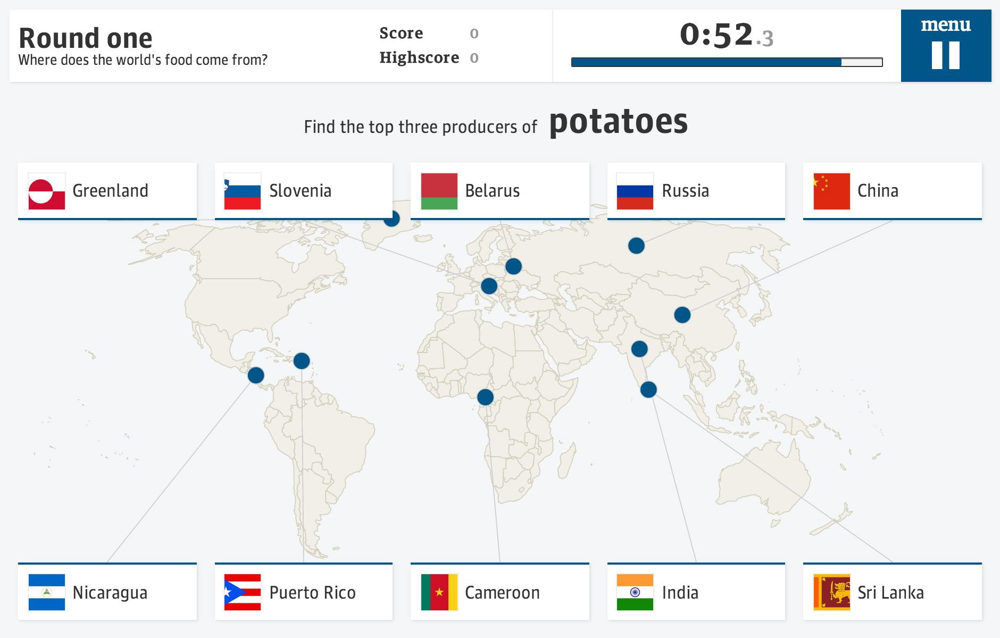

# Introducing Ractive.js

*Originally posted on the [Guardian developer blog](http://www.theguardian.com/info/developer-blog/2013/jul/24/ractive-js-next-generation-dom-manipulation)*


<small>Ractive.js is used to create guardian.co.uk interactives, such as [Food game: How well do you know the world?](http://www.theguardian.com/global-development/interactive/2013/jun/07/food-game-what-do-you-know)</small>

Anyone with fond memories of the [sound of dial-up internet](http://www.youtube.com/watch?v=gsNaR6FRuO0) will understand how ridiculous it would have seemed, to the web's pioneers, that we would one day be using this geeky information exchange format to play games, do grocery shopping, collaborate on spreadsheets and even [build more webapps](https://c9.io/). Yet here we are.

But despite taking over the world, the web has a dirty secret: it's actually a lousy platform for creating many of the experiences we take for granted. Let me qualify that: it's an amazing technology for creating *documents*, but for creating *apps* - interactive experiences that respond to user input, and represent changing data - web development can be akin to pulling teeth.

<!-- break -->

Consider the following simple task. We have an interface that shows our user, Dave, how many unread messages he has. When he gets a new message, how do we update the interface?

```html
<p>Hello Dave! You have 4 new messages.</p>
```

In the bad old days, you'd have to reload the page, and the server would send you some freshly-rendered HTML. But let's assume we've got a model that contains our data, and that we need to update the existing view. Here are our options:

## 1. Just use jQuery

```js
var p = $('p');

function updateView (username, msgCount) {
	p.text('Hello ' + username + '! You have ' + msgCount + ' new messages.');
};
```

This is generally agreed to be a Bad Idea - mixing your templates and your logic will end in tears. What if a non-programmer needs to change the wording? They'll probably break something, that's what.

## 2. Target specific elements

```html
<p>
	Hello <span id='username'></span>!
	You have <span id='msgCount'></span> new messages.
</p>
```

```js
var usernameSpan = $('#username'),
	msgCountSpan = $('#msgCount');

function updateUserName (username) {
	usernameSpan.text(username);
};

function updateMsgCount (msgCount) {
	msgCountSpan.text(msgCount);
};

// initialise our view
updateUsername(model.username);
updateMsgCount(model.msgCount);
```

Better, except that now we've added two extra `<span>` elements to the DOM. That means more work for the browser, which can become particularly noticeable on mobile devices. And we've got to traverse the DOM and store references to elements.

## 3. Templating

```html
<p>Hello <%= username %>! You have <%= msgCount %> new messages.</p>
```

Now we're getting somewhere - our templates and our logic are cleanly separated. But wait! What happens when we update the view?

```js
var body = $(body),
	// we're using Underscore templates here
	template = new _.template(templateStr);

function updateView (model) {
	var html = template({
		username: model.username,
		msgCount: model.msgCount
	});

	body.html(html);
};

// initialise
updateView(model);
```

What happens is that the existing element gets removed from the DOM, and a new one gets created. At best, the old one will be hoovered up by the [garbage collector](https://developer.mozilla.org/en-US/docs/Web/JavaScript/Memory_Management); at worst, it will remain in memory. Either way, it's bad for performance.

In the context of this contrived example it might seem trivial, but as an app becomes more complex, these things start to show.

## 4. Just use Angular

At this point, many developers will point you towards a framework such as [AngularJS](http://angularjs.org) or [EmberJS](http://emberjs.com/). These frameworks do a lot of the heavy lifting for you, particularly as far as model-view data binding is concerned.

Angular in particular is hugely popular at the moment. (The Guardian is currently using it for a major internal project, in fact.)

But these frameworks also have a cost - they tend to be fairly large, and once you've finished the 'hello world' tutorials they have steep learning curves. Particularly for smaller projects, it's often a case of using a sledgehammer to crack a nut.

You see the problem. What should be an incredibly basic task is a snakepit of compromises and ugly code - yet we're all so used to developing this way that we're barely even aware of how awkward it is.

## Enter Ractive.js

Ractive was initially created to tackle the data binding problem in a more elegant way. We on the [Guardian interactive team](http://www.guardian.co.uk/profile/guardian-interactive-department) are acutely aware of the challenges of creating app-like experiences on the web; interactives, by their nature, require a huge amount of DOM manipulation, and as slaves to the editorial agenda we typically have tight deadlines.

The above example, with Ractive, would go something like this:

```html
<p>Hello {{username}}! You have {{msgCount}} new messages.</p>
```

```js
var view = new Ractive({
	el: document.body,
	template: templateStr,
	data: model // contains our username and msgCount properties
});

function updateView (model) {
	view.set(model);
};
```

Initially, Ractive parses the template and determines that `{{msgCount}}` should be treated as a separate *text node*, which depends on the `msgCount` property of our model.

When you call `view.set()`, Ractive compares the new data against its current state, and scans its internal dependency graph to see if any part of the DOM needs to be updated. If so, it only touches those parts - which means no DOM nodes will be created or destroyed.

The browser has much less work to do, but - and this is the crucial part - so does the developer. The benefits of this approach become increasingly apparent as you deal with more complex templates, representing more complex data. You can see for yourself how it makes life easier by following the [tutorials](http://learn.ractivejs.org) or checking out the [examples](http://examples.ractivejs.org).

## Beyond data binding

It soon became apparent that this approach enables us to do other things more efficiently as well. It's a philosophical change in the relationship between HTML and JavaScript - HTML is no longer an inert substance which must have life breathed into it, but a blueprint for an app that is interactive by default.

Take event handling for example. Web developers are used to peppering their HTML with meaningless `id` and `class` attributes as 'hooks', so that they can later traverse the DOM, find them, and add event handlers:

```html
<button id='activate'>Activate!</button>
<button id='deactivate'>Deactivate!</button>
```

```js
$('#activate').on('click', function () {
	alert('Activating!');
});

$('#deactivate').on('click', function () {
	alert('Deactivating!');
});
```

But if you treat the HTML as a blueprint, you can bake the semantics of user interaction right into your template:

```html
<button proxy-click='activate'>Activate!</button>
<button proxy-click='deactivate'>Deactivate!</button>
```

```js
view.on({
	activate: function () {
		alert('Activating!');
	},
	deactivate: function () {
		alert('Deactivating!');
	}
});
```

Moreover, we can now automatically take care of things like reusing event handlers and automatically unbinding them when they're no longer needed. Event delegation becomes unnecessary. As with data binding, this approach prevents your code from becoming unwieldy as your app grows.

## Sexy features

So far, this all sounds fairly prosaic - handy, perhaps, but nothing you can't already do with [vanilla JS](http://vanilla-js.com/). But the real fun starts when we start exploiting some of the features that emerge from Ractive's statefulness and dependency tracking, such as complex but easy-to-create animations. We're one step closer to the holy grail of completely declarative, reactive programming.

But we're only getting started. While it's been used in production in several interactives, it's still an early-stage project which needs brave souls to try it out in projects and (if necessary!) submit bug reports. If you build something with it, we'd love to hear from you.


<small>Interactive [data visualisations](../get-started/examples/animated-chart.md) are much easier to create with Ractive.js - no DOM event handling, no state management, no labyrinthine render methods</small>

## Acknowledgements

The development of Ractive was made possible, in part, by the [Bill and Melinda Gates Foundation](http://www.gatesfoundation.org/)'s support for the Guardian [Global Development](http://www.guardian.co.uk/global-development) desk.
